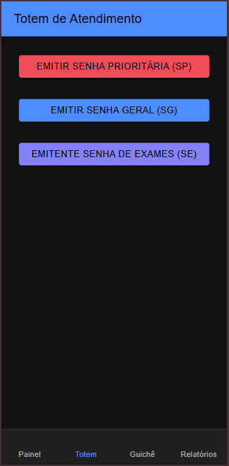
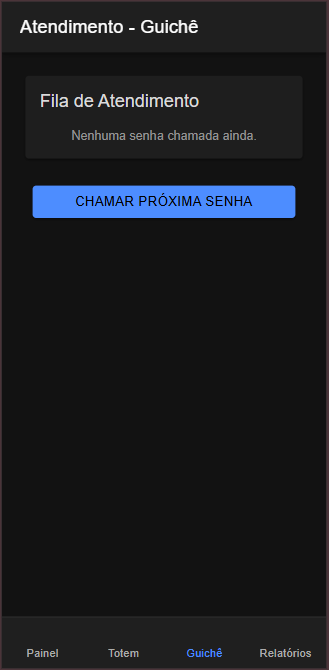
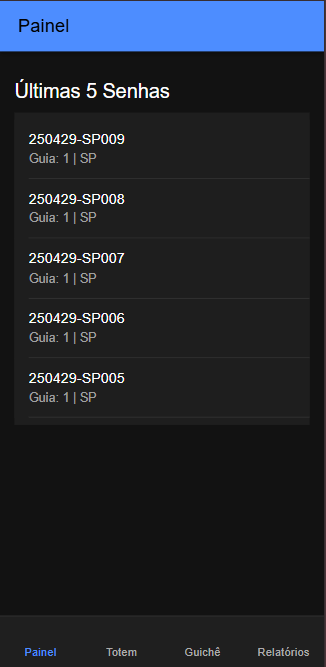

# tickets

**Aplicativo Móvel de Controle de Senhas para Laboratórios Médicos**

Este repositório contém o código-fonte de um _app_ híbrido (Ionic + Angular) para controle de atendimento em filas de laboratórios médicos, desenvolvido como trabalho de disciplina.

---

## 📱 Sobre o Projeto

- **Plataforma:** Mobile (Ionic Framework + Angular)
- **Escopo:** Frontend standalone (não há integração com backend ou banco de dados; toda informação é gerenciada em LocalStorage)
- **Agentes:**  
  - AS (Agente Sistema) — Emite senhas via totens  
  - AA (Agente Atendente) — Chama próximas senhas no guichê  
  - AC (Agente Cliente) — Recebe senha e aguarda no painel  

### Principais Funcionalidades

1. Totem de Senhas (SP, SE, SG)
2. Chamada de Senhas no Guichê (priorização automática)
3. Painel de Chamadas (exibe últimas 5 senhas)
4. Relatórios (visão diária e mensal)
5. Persistência local via LocalStorage (sem backend)

---

## 🎨 Telas do Aplicativo

### 1. Totem de Emissão de Senhas


### 2. Guichê de Atendimento


### 3. Painel de Chamadas


---

## ⚙️ Requisitos para Rodar o Projeto

- Node.js (versão >= 18.x)  
- Ionic CLI (>= 6.x)  
- Angular CLI (>= 15.x)  

### Passos

1. Clone o repositório:
   ```bash
   git clone https://github.com/<seu-usuario>/tickets.git
   cd tickets
   ```
2. Instale as dependências:
   ```bash
   npm install
   ```
3. Inicie o app em modo de desenvolvimento:
   ```bash
   ionic serve
   ```
4. Acesse no seu navegador ou emulador via: `http://localhost:8100`

---

## 👨‍💻 Submissão Individual

- Embora o projeto possa ser desenvolvido em grupo, cada aluno deve realizar a própria **submissão individual**.
- Este repositório é público e atende ao requisito de entrega de nota.

---

## 📄 Licença

Este trabalho está licenciado sob a licença **Creative Commons – Atribuição 4.0 Internacional (CC BY 4.0)**.  
Consulte o arquivo [LICENSE](LICENSE.md) para detalhes.

---

> Desenvolvido como parte da disciplina de Sistemas de Informação – Trabalho Individual

